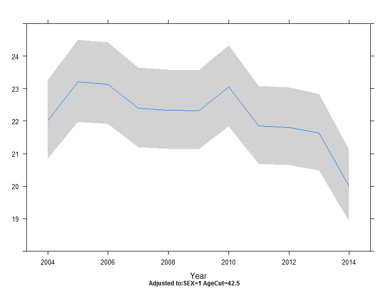
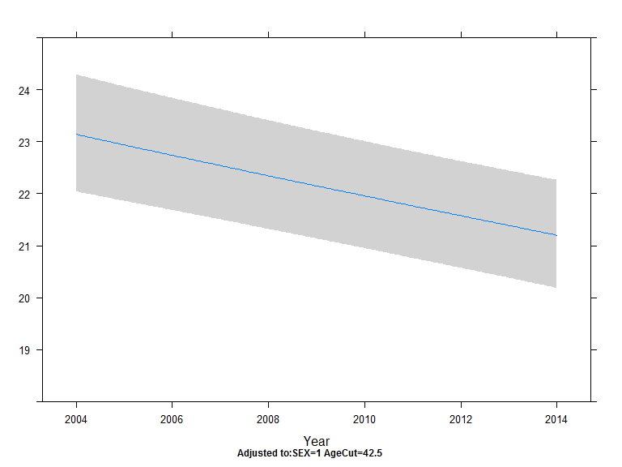
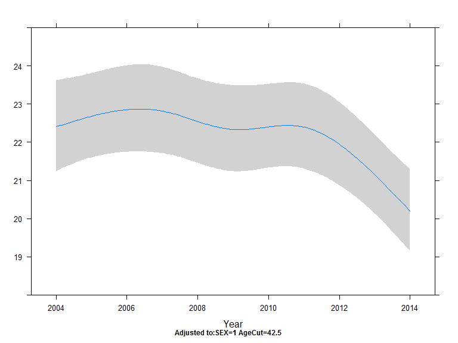
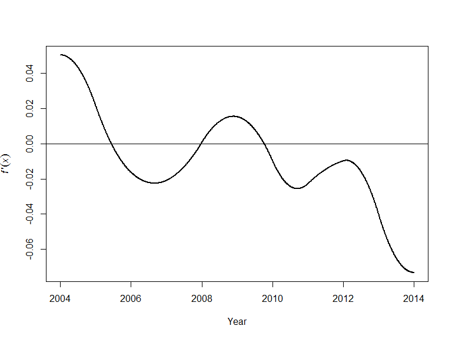
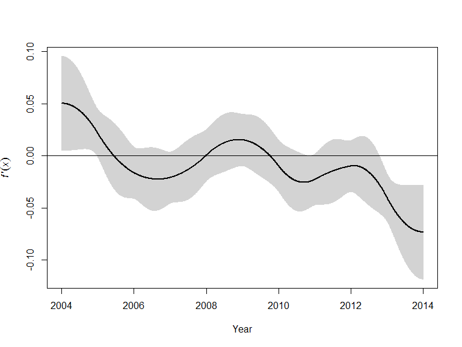
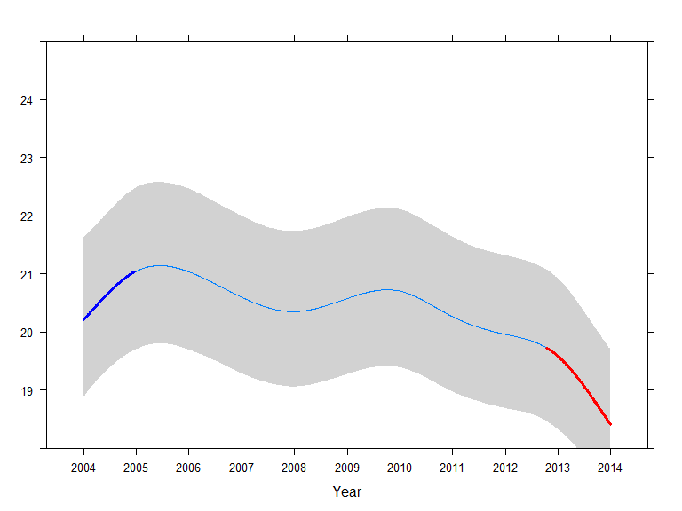

# Hogyan modellezzük betegségek előfordulásának időbeli változását?
Ferenci Tamás$^1$  
Kolossváry Endre$^2$  
2017\. június 9\.  


# Bevezetés, klasszikus megoldások

## Betegségek előfordulásának időbeli változása

- Az epidemiológiai egyik alapvető kérdése
- Számos előfordulási adat érhető el idősorosan
- Könnyen gyártható is ilyen adminisztratív/finanszírozási adatokból
- Klasszikus elemzési eszköztár (különböző időtartamokra aggregálás és ábrázolás, standardizálás stb.) vs. korszerű -- regressziós -- modellezés

## A regressziós modellezés előnyei és hátrányai

Előnyök:

- Több tényező figyelembevétele teljesen kézenfekvő
- ,,Beépített'' standardizálás
- Jól felhasználható (interpretálható, ábrázolható, CI-vel ellátható stb.) eredmények
- Kiforrott apparátus, jó számítástechnikai támogatás

Hátrányok:

- A modellfeltevések maguk is bejönnek, teljesülésük kérdés, ellenőrizni kell őket

## Esettanulmány

- Alsó végtagi érbetegségek talaján előforduló major amputációk
- Adatforrás: ÁEEK (adminisztratív/finanszírozási adatbázis)
- 2004-től 2014-ig tart a most vizsgált idősor
- Ismert az alany neme és életkora (számos más is, de azokat most nem használjuk)

## Függvényforma-választás

Klasszikusan: paraméteres (pl. $\beta_0+\beta_{Year} Year$) vs. nem-paraméteres (pl. $\beta_0+\beta_{Year=2005}D_{Year=2005}+\beta_{Year=2006}D_{Year=2006}+\ldots+\beta_{Year=2014}D_{Year=2014}$)

## Nemparaméteres függvényforma (az év példáján)


```r
fit.nempara <- Glm( N ~ scored( Year ) + scored( Month ) + SEX*rcs( AgeCut ),
                    offset = log( Population ), data = TimeStratified,
                    family = poisson( link = log ) )
plot( Predict( fit.nempara, fun = exp100k, Year, Month = 6 ), ylim = c( 18, 25 ) )
```

<!-- -->

## Paraméteres függvényforma (az év példáján)


```r
fit.para <- Glm( N ~ Year + scored( Month ) + SEX*rcs( AgeCut ),
                 offset = log( Population ), data = TimeStratified,
                 family = poisson( link = log ) )
plot( Predict( fit.para, fun = exp100k, Year, Month = 6 ), ylim = c( 18, 25 ) )
```

<!-- -->

## Nemparaméteres vs. paraméteres: szempontok a választáshoz

- Illeszkedés jósága vs. takarékosság (és ebből adódóan: becsülhetőség, általánosítóképesség)

```
##    Függvényforma df $\\chi^2$      AIC
## 1 Nemparaméteres 31  102725.1 16160.11
## 2    Paraméteres 22  102686.2 16181.01
```
- Klinikai interpretálhatóság
- Időbeli extrapolálhatóság

# Egy fél-paraméteres megoldás: spline-ok használata

## A spline-ok lényege {.allowframebreaks}

- Technikailag paraméteres, de olyan komplex a függvényforma, hogy úgysem interpretáljuk
- Alapgondolat: cserében ezért kapjunk olyan megoldást, ami egyszerre flexibilis (mint a nem-paraméteresek), de közben takarékos a szabadsági fokokkal (mint a paraméteresek)
- Egymondatos definíció: a spline szakaszonként definiált polinomokból összerakott görbe (úgy, hogy a szakaszok találkozási pontjánál, a csomópontoknál szép simán menjenek át egymásba)
- Talán a leggyakoribb a korlátozott köbös spline: harmadfokú polinomok, a csomópontoknál azonos érték, derivált és második derivált (belátható, hogy ez azt fogja jelenteni, hogy egy globális harmadfokú függvényt kell venni, és szakaszonként csak a harmadfokú tagot kell eltéríteni), az első pont előtt és az utolsó után pedig lineárisan megy tovább (ez még tovább egyszerűsít)
- $k$ csomópont esetén $k-1$ paramétert kell becsülni (a csomópontok számát és helyét általában nem statisztikai becsléssel határozzuk meg)

## Emlékeztetőül: nemparaméteres függfényvforma


```r
fit.nempara <- Glm( N ~ scored( Year ) + scored( Month ) + SEX*rcs( AgeCut ),
                    offset = log( Population ), data = TimeStratified,
                    family = poisson( link = log ) )
plot( Predict( fit.nempara, fun = exp100k, Year, Month = 6 ), ylim = c( 18, 25 ) )
```

<!-- -->

## Emlékeztetőül: paraméteres függfényvforma


```r
fit.para <- Glm( N ~ Year + scored( Month ) + SEX*rcs( AgeCut ),
                 offset = log( Population ), data = TimeStratified,
                 family = poisson( link = log ) )
plot( Predict( fit.para, fun = exp100k, Year, Month = 6 ), ylim = c( 18, 25 ) )
```

<!-- -->

## És a spline-okkal történő megoldás


```r
fit.spline <- Glm( N ~ rcs( Year ) + scored( Month ) + SEX*rcs( AgeCut ),
                   offset = log( Population ), data = TimeStratified,
                   family = poisson( link = log ) )
plot( Predict( fit.spline, fun = exp100k, Year, Month = 6 ), ylim = c( 18, 25 ) )
```

<!-- -->

## Összehasonlítás

- Illeszkedés jósága vs. takarékosság

```
##    Függvényforma df $\\chi^2$      AIC
## 1 Nemparaméteres 31  102725.1 16160.11
## 2         Spline 25  102709.8 16163.42
## 3    Paraméteres 22  102686.2 16181.01
```
- Klinikai interpretálhatóság
- Időbeli extrapolálhatóság

# Interpretálhatóság javítása a félparaméteres megoldásnál

## Az alapgondolat

- Mi érdekel minket elsősorban?
- Az egyik nagyon fontos kérdés: mikor vált ritkábbá (vagy épp gyakoribbá) a betegség?
- Lefordítva: a függvényforma deriváltját keressük!

## Véges differenciák módszere

- A paraméteres függvényformák triviális deriválhatóak (pláne a lineáris), de mi a helyzet a spline-okkal?
- Elég nyakatekert, de szerencsére egy huszárvágással megoldhatjuk az egész problémát
- A deriválást közelítve *bármilyen* függvényformára meg tudjuk oldani a problémát; kissé nagyképűen szólva, a véges differenciák módszerét alkalmazzuk:
\[
f'\left(x\right)=\frac{f\left(x+h\right)-f\left(x\right)}{h}\Bigg\rvert_{h \textrm{ kicsi}}
\]

## Spline deriválás véges differenciák módszerével R-ben

Szerencsére Gavin Simpson már eleve megírta nekünk az \texttt{mgcv} csomaghoz illeszkedően:

- Github: [gavinsimpson / Deriv.R](https://gist.github.com/gavinsimpson/e73f011fdaaab4bb5a30)
- Github: [gavinsimpson / derivSimulCI.R](https://gist.github.com/gavinsimpson/ca18c9c789ef5237dbc6)

A releváns kódrészlet:


```r
X0 <- predict(mod, newDF, type = "lpmatrix")
newDF <- newDF + eps
X1 <- predict(mod, newDF, type = "lpmatrix")
Xp <- (X1 - X0) / eps
```

## Az eredmény


```r
fit <- gam( N ~ s( Year ) + s( Month, bs = "cc" ) + s( AgeCut, by = SEX ) + SEX,
            offset = log( Population ), data = TimeStratified, family = "poisson" )
fit.d <- Deriv( fit, n = 1000, m.terms.var = c( "Year", "Month", "AgeCut" ),
                newdatafix = data.frame( SEX = as.factor( 1 ) ) )
plot( fit.d, term = "Year", alpha = 1 )
```

<!-- -->


## De a poén csak most jön

- A deriválás azért nem volt egy akkor tudományos eredmény\dots{}
- Jó lenne tudni azt is, hogy ez hol szignifikáns!
- Most jön a szép rész: a deriváltra tudunk konfidenciaintervallumot is adni!

```r
for(i in seq_len(nt)) {
  Xi <- Xp * 0
  want <- grep(t.labs[i], colnames(X1))
  Xi[, want] <- Xp[, want]
  df <- Xi %*% coef(mod)
  df.sd <- rowSums(Xi %*% mod$Vp * Xi)^.5
  lD[[i]] <- list(deriv = df, se.deriv = df.sd)
}
```
- Vagy pedig: poszterior szimulációval

## Az eredmény (konfidenciaintervallummal)

<!-- -->

## És a nagyfinálé


```r
fit.d.CI <- confint( fit.d, "Year" )
fit.d.signif <- signifD( pred$fit, fit.d$Year$deriv, fit.d.CI$Year$upper, fit.d.CI$Year$lower )
xYplot( Cbind( fit, lwr, upr )~predtime, data = pred, method = "filled bands", type = "l",
        col.fill = gray( seq( .825, .55, length = 5 ) ), xlab = "Year", ylab = "",
        scales = list( x = list( at = predtime[1]:tail( predtime, 1 ) ) ), ylim = c( 18, 25 ) ) +
  as.layer( xyplot( fit.d.signif$incr~predtime, type = "l", lwd = 3, col = "blue" ) ) +
  as.layer( xyplot( fit.d.signif$decr~predtime, type = "l", lwd = 3, col = "red" ) )
```

<!-- -->

## Összefoglalva

- A paraméteres modellek jól interpretálhatóak, extrapolálhatóak, de kérdéses lehet az illeszkedésük a valósághoz
- A nemparaméteres modelleknél lényegében fordított az előny/hátrány helyzet
- A spline-okat használó (félparaméteres) modellek jó kompromisszumot jelentenek
- A bemutatott módszerrel pedig némileg még az interpretálhatóságuk is javítható
